# TechLecture App

TechLecture is a communication platform designed for interaction between lecturers and students during physical lectures. The application allows lecturers to present their lecture files from their designated area in the application. Meanwhile, students connected to the lecture online through their laptops or iPads can instantly upload files during the lecture.

## Deployment

The application is deployed at [https://techlectureback.onrender.com/](https://techlectureback.onrender.com/).

## Features

1. **Registration**: Users can create new accounts by registering on the platform.
2. **Login**: Registered users can log in to their accounts.
3. **Create New Lecture**: Lecturers can create a new lecture session.
4. **Join Existing Lecture**: Users can join an existing lecture.
5. **Delete Lecture**: Lecturers have the ability to delete an existing lecture.
6. **Permission for Students to Upload Files**: Lecturers can dynamically grant students permission to upload files during the ongoing lecture..
7. **Prevent Students from Uploading Files**: Lecturers can revoke the permission for students to upload files during the ongoing lecture.

## Technologies Used

1. **MongoDB**: Database used for storing application data.
2. **Express.js**: Web application framework for Node.js used for building the backend.
3. **React**: JavaScript library for building user interfaces used for the frontend.
4. **Node.js**: JavaScript runtime environment used for running the server.

## How to Run

1. Install dependencies:
   ```bash
   npm install
   nodemon server.js
   
## Screenshots

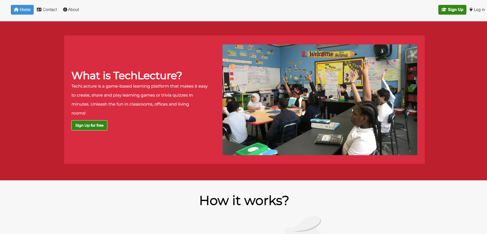
*Home Screen*

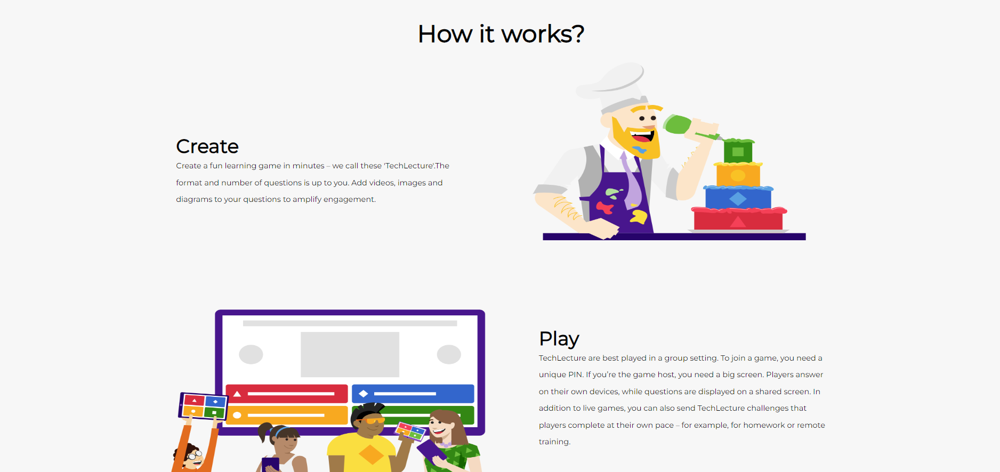
*Home Screen*

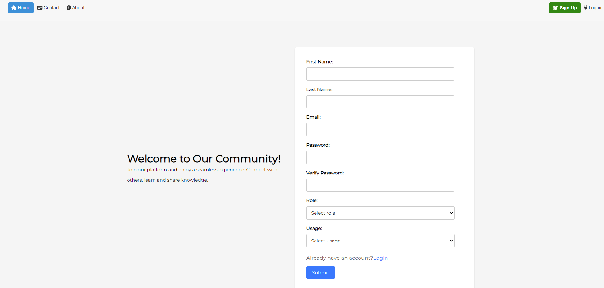
*Registration Form*

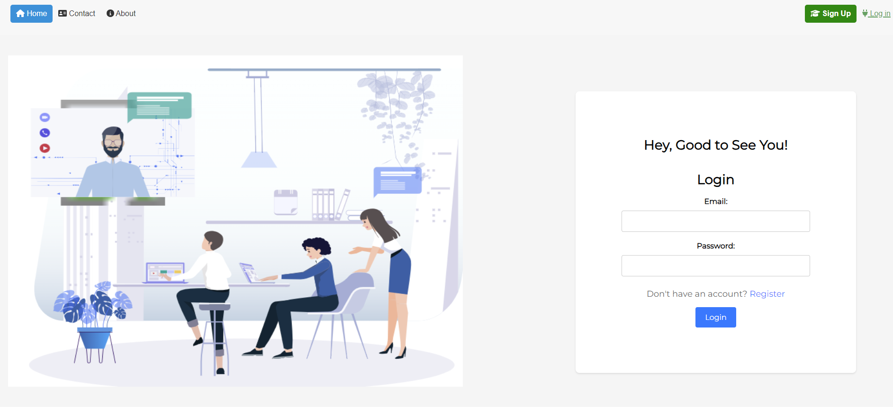
*Login Form*

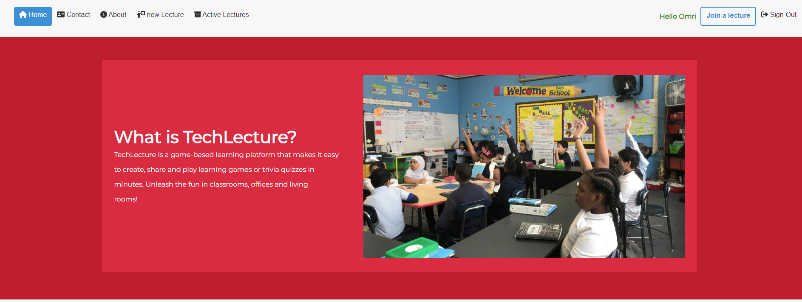
*Identification of an authenticated user..*

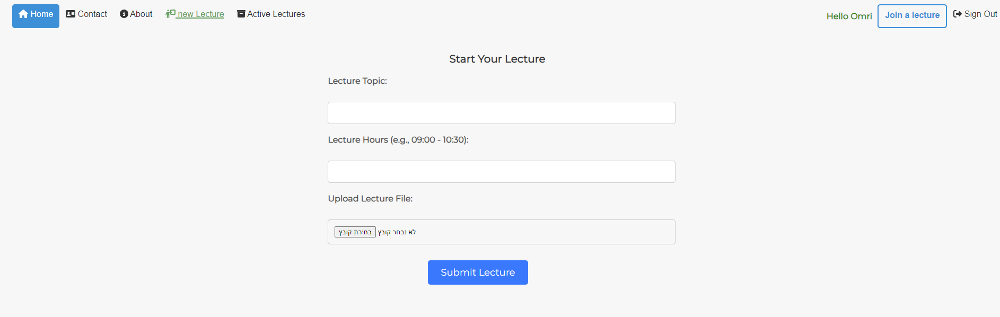
*Creating a new lecture Form*

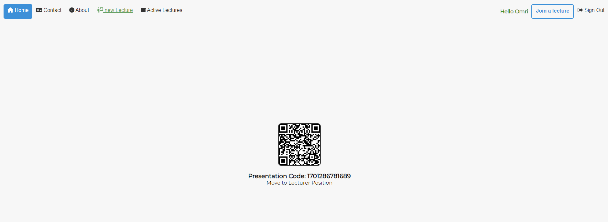
*Upon creating a new lecture, a barcode is generated for students to easily join.*

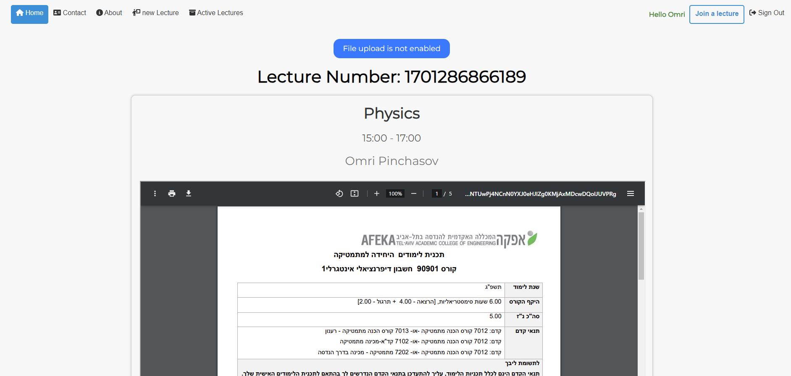
*Lecturer Position.*

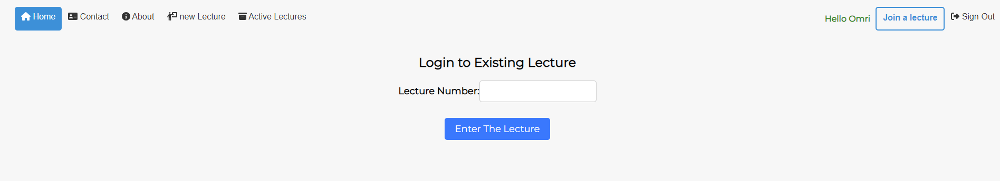
*Joining a lecture form.*

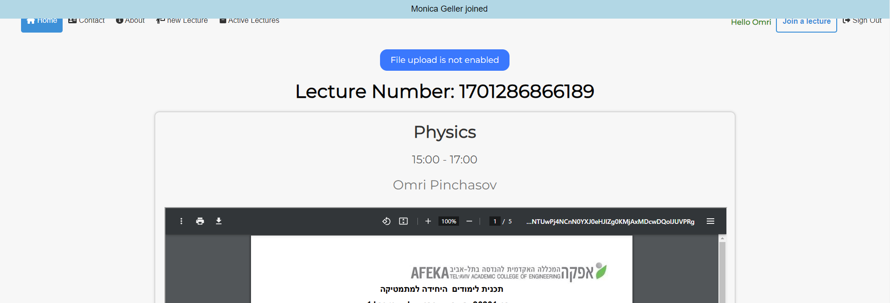
*Popup notifying that a new user has joined the lecture.*

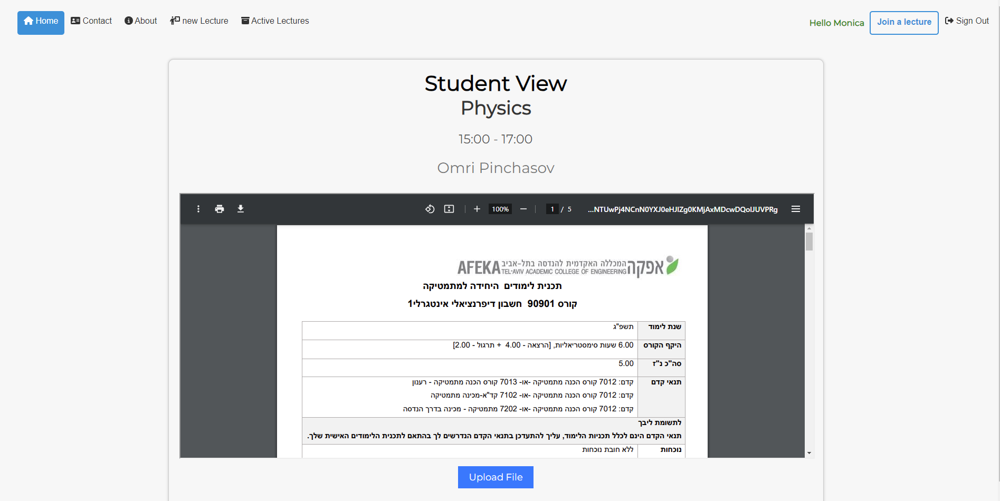
*Student position during the lecture.*

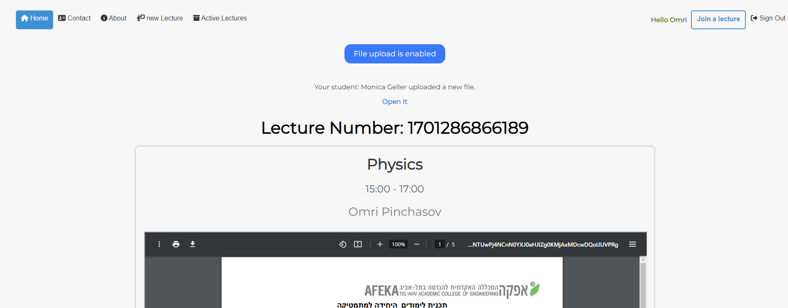
*Popup alerting that a student has uploaded a file during the lecture, with a link to view the file.*

